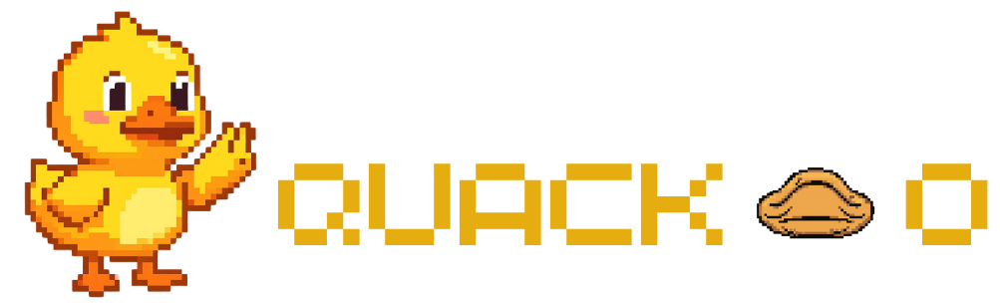

<div align="center">



# Quack-O

**Learn languages one Quack at a time.**

A gamified language-learning mobile app built with Flutter and a Laravel REST API.


</div>

---

## About

Quack-O is a Duolingo-style language-learning app starring a pixel-art duck. Learners follow a guided course path, practice with mini-games, earn rewards, keep their streak alive and compete with friends on a league leaderboard.

This project was built for the **Mobile Programming (UTS)** course, Group 9.

## Features

**Learning**
- Course path with sections, units and lessons, each with its own question set
- Multiple question types, text-to-speech pronunciation and sound effects
- Three courses: **English**, **Japanese** and **Korean** (with romanization support)
- Guidebook and vocabulary list for every course

**Practice**
- **Word Hunt**: find vocabulary words in a grid
- **Memory Game**: match words with their meanings
- **Word Chase** (Kejar Kata): timed multiple-choice with scoring
- **Mistake Review**: retry the questions you got wrong

**Progress and rewards**
- Daily streak with a streak calendar and milestone rewards
- Daily and weekly quests
- Daily spin wheel, reward chests and gems
- Shop, inventory and a virtual duck pet
- League system and a global leaderboard

**Social and account**
- Register, log in and reset your password with an emailed code
- Customizable profile and avatar editor
- Follow, like, block and report other users, user search, friends list and shareable profile card

## Tech Stack

| Layer | Technology |
|---|---|
| Mobile app | Flutter, Dart (`http`, `provider`, `shared_preferences`, `flutter_tts`, `audioplayers`, `flutter_svg`, `google_fonts`, `gal`) |
| Backend | Laravel 12, PHP 8.2+, Laravel Sanctum (token auth) |
| Database | MySQL |

## Project Structure

```
moprog_uts/
├── lib/
│   ├── main.dart
│   ├── models/      # Data models (question, vocabulary, league, ...)
│   ├── pages/       # Full-screen pages (login, lesson, games, shop, ...)
│   ├── tabs/        # Main tabs: Learn, Practice, Leaderboard, Quests, Profile
│   ├── services/    # API client, auth session, progress sync, TTS, ...
│   └── widgets/     # Reusable UI components
├── assets/          # Images, avatars, flags, icons, sounds, lesson content
├── backend/         # Laravel REST API
│   ├── app/Http/Controllers/Api/
│   ├── database/    # Migrations and seeders
│   └── routes/api.php
└── tools/           # Helper scripts for preparing avatar assets
```

## Getting Started

### Prerequisites

- [Flutter SDK](https://docs.flutter.dev/get-started/install) (Dart `^3.13`)
- PHP 8.2+ and [Composer](https://getcomposer.org/)
- MySQL (for example via XAMPP or Laragon)
- Android Studio with an emulator, or a physical Android device

### 1. Set up the backend

```bash
cd backend
composer install
```

The repo does not include a `.env` file (it is git-ignored). Create `backend/.env` yourself, then generate the app key:

```bash
php artisan key:generate
```

Minimum settings for `backend/.env` (create an empty database first):

```env
APP_NAME=Quack-O
APP_ENV=local
APP_DEBUG=true
APP_URL=http://127.0.0.1:8000

DB_CONNECTION=mysql
DB_HOST=127.0.0.1
DB_PORT=3306
DB_DATABASE=quack-o
DB_USERNAME=root
DB_PASSWORD=
```

Run the migrations and seed the course content:

```bash
php artisan migrate --seed
```

Start the API so that emulators and phones can reach it:

```bash
php artisan serve --host=0.0.0.0 --port=8000
```

#### Password reset emails (optional)

The forgot-password flow sends a code by email. To enable it, configure SMTP in `backend/.env`. For Gmail, use an [App Password](https://myaccount.google.com/apppasswords) (2-Step Verification must be on), **not** your normal password:

```env
MAIL_MAILER=smtp
MAIL_HOST=smtp.gmail.com
MAIL_PORT=587
MAIL_USERNAME=your-address@gmail.com
MAIL_PASSWORD=your-16-char-app-password
MAIL_FROM_ADDRESS=your-address@gmail.com
```

Never commit your `.env` file or real credentials.

### 2. Run the Flutter app

```bash
flutter pub get
flutter run
```

The API address is chosen automatically:

| Target | API URL |
|---|---|
| Android emulator | `http://10.0.2.2:8000/api` |
| Web, Windows, iOS simulator | `http://127.0.0.1:8000/api` |

To use a physical device or any other address, pass it at launch (use your computer's LAN IP, on the same Wi-Fi):

```bash
flutter run --dart-define=API_URL=http://<your-ip>:8000/api
```

## API Overview

Public endpoints

| Method | Endpoint | Description |
|---|---|---|
| POST | `/register` | Create an account |
| POST | `/login` | Log in and receive a token |
| POST | `/forgot-password` | Email a reset code |
| POST | `/reset-password` | Set a new password with the code |
| GET | `/languages`, `/languages/{code}/path` | Available courses and their path |
| GET | `/lessons`, `/lessons/{id}/questions` | Lessons and questions |
| GET | `/vocabularies` | Vocabulary for the practice games |
| GET | `/leaderboard` | Global leaderboard |

Authenticated endpoints (Bearer token via Sanctum)

`/profile`, `/progress`, `/inventory`, `/users/*` (search, follow, like, block, report), `/posts`, `/logout`

See [backend/routes/api.php](backend/routes/api.php) for the full list.

## Troubleshooting

- **`Connection refused` on login**: the backend is not running, or the app points to the wrong address. Start `php artisan serve --host=0.0.0.0`, and use `--dart-define=API_URL=...` on a physical device.
- **No reset email arrives**: check `backend/storage/logs/laravel.log`. A `535 BadCredentials` error means Gmail needs an App Password.
- **Emulator is slow or disconnects**: give the AVD at least 4 GB of RAM and enable hardware acceleration.

## Team

Group 9, Mobile Programming

- Fakhzul Rafli S
- Luthfi Rahman
- Lucio Aurey Feliciano
- Neizar Apriansyah
- Adrian Rizki Bintang
